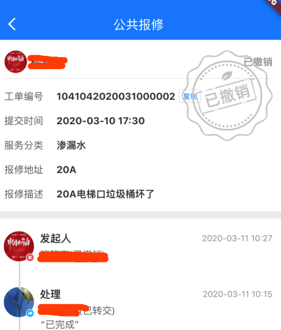

# 从实际场景出发，看flutter中事件分发机制


### 起因

#### 实际场景

一个水印遮盖住了拥有点击事件按钮监听的复制工单编号按钮

**有图有真相**



**布局代码**

由于水印需要完整显示，所以必须在 `Stack` 布局的最顶层

```dart
return Stack(
      children: <Widget>[
        buildFormContent(),
        Positioned(
          right: 0,
          top: 0,
          child: Offstage(
            offstage: statusAssetImage(state.detail.status).isEmpty,
            child: Image.asset(
                statusAssetImage(state.detail.status),
                height: 130,
                width: 130,
                fit: BoxFit.fill,
            ),
          ),
        ),
      ],
    );
```

#### 结果

复制按钮无法响应点击事件

#### 需求

就算水印图片盖住了复制按钮，复制按钮也应该响应点击事件

### 寻找问题源头

#### 触摸事件的源头

在 **flutter** 中，无论是 **Android** 还是 **iOS** 原生层都只是将所有事件打包下发,整个触摸手势事件实质上经历了 `JAVA => C++ => Dart` 的一个流程，所以我们这里不需要对这块进行过多解释，大概理解就可以了

#### flutter的事件流程

**GestureBinding**

在flutter中 `GestureBinding` 这个胶水类的 `_handlePointerDataPacket` 方法是最先接收到触摸事件的地方 `_handlePointerDataPacket=>_flushPointerEventQueue=>_handlePointerEvent`

```dart
  void _handlePointerEvent(PointerEvent event) {
    assert(!locked);
    HitTestResult hitTestResult;
    if (event is PointerDownEvent || event is PointerSignalEvent) {
      assert(!_hitTests.containsKey(event.pointer));
      hitTestResult = HitTestResult();
      //开始碰撞测试
      hitTest(hitTestResult, event.position);
      if (event is PointerDownEvent) {
        _hitTests[event.pointer] = hitTestResult;
      }
      assert(() {
        if (debugPrintHitTestResults)
          debugPrint('$event: $hitTestResult');
        return true;
      }());
    } else if (event is PointerUpEvent || event is PointerCancelEvent) {
      hitTestResult = _hitTests.remove(event.pointer);
    } else if (event.down) {
      // Because events that occur with the pointer down (like
      // PointerMoveEvents) should be dispatched to the same place that their
      // initial PointerDownEvent was, we want to re-use the path we found when
      // the pointer went down, rather than do hit detection each time we get
      // such an event.
      hitTestResult = _hitTests[event.pointer];
    }
    assert(() {
      if (debugPrintMouseHoverEvents && event is PointerHoverEvent)
        debugPrint('$event');
      return true;
    }());
    if (hitTestResult != null ||
        event is PointerHoverEvent ||
        event is PointerAddedEvent ||
        event is PointerRemovedEvent) {
      dispatchEvent(event, hitTestResult);
    }
  }
```

#### hitText 碰撞测试

**hitText的作用**

由点击事件的位置，由至上而下获取与点击事件位置相重合的小部件，将其加到 `HitTestResult` 中

由于此时 `GestureBinding` 的真实实例其实是 `WidgetsFlutterBinding`

```dart
/// A concrete binding for applications based on the Widgets framework.
///
/// This is the glue that binds the framework to the Flutter engine.
class WidgetsFlutterBinding extends BindingBase with GestureBinding, ServicesBinding, SchedulerBinding, PaintingBinding, SemanticsBinding, RendererBinding, WidgetsBinding {

  /// Returns an instance of the [WidgetsBinding], creating and
  /// initializing it if necessary. If one is created, it will be a
  /// [WidgetsFlutterBinding]. If one was previously initialized, then
  /// it will at least implement [WidgetsBinding].
  ///
  /// You only need to call this method if you need the binding to be
  /// initialized before calling [runApp].
  ///
  /// In the `flutter_test` framework, [testWidgets] initializes the
  /// binding instance to a [TestWidgetsFlutterBinding], not a
  /// [WidgetsFlutterBinding].
  static WidgetsBinding ensureInitialized() {
    if (WidgetsBinding.instance == null)
      WidgetsFlutterBinding();
    return WidgetsBinding.instance;
  }
}
```

**RendererBinding.hitText**

从 `mixin` 的顺序来看的话，应该是先调用 `RendererBinding` 的 `hitText` 方法

```dart
  @override
  void hitTest(HitTestResult result, Offset position) {
    assert(renderView != null);
    renderView.hitTest(result, position: position);
    super.hitTest(result, position);
  }
```

这里看到进入了 `RenderView.hitText`

**RenderView.hitText**

```dart
  /// Determines the set of render objects located at the given position.
  ///
  /// Returns true if the given point is contained in this render object or one
  /// of its descendants. Adds any render objects that contain the point to the
  /// given hit test result.
  ///
  /// The [position] argument is in the coordinate system of the render view,
  /// which is to say, in logical pixels. This is not necessarily the same
  /// coordinate system as that expected by the root [Layer], which will
  /// normally be in physical (device) pixels.
  bool hitTest(HitTestResult result, { Offset position }) {
    if (child != null)
      child.hitTest(BoxHitTestResult.wrap(result), position: position);
    result.add(HitTestEntry(this));
    return true;
  }
```

这里看到进入了 `RenderBox.hitText`

**RenderBox.hitText**

解决问题的**重点**来了

```dart
  /// Determines the set of render objects located at the given position.
  ///
  /// Returns true, and adds any render objects that contain the point to the
  /// given hit test result, if this render object or one of its descendants
  /// absorbs the hit (preventing objects below this one from being hit).
  /// Returns false if the hit can continue to other objects below this one.
  ///
  /// The caller is responsible for transforming [position] from global
  /// coordinates to its location relative to the origin of this [RenderBox].
  /// This [RenderBox] is responsible for checking whether the given position is
  /// within its bounds.
  ///
  /// If transforming is necessary, [BoxHitTestResult.addWithPaintTransform],
  /// [BoxHitTestResult.addWithPaintOffset], or
  /// [BoxHitTestResult.addWithRawTransform] need to be invoked by the caller
  /// to record the required transform operations in the [HitTestResult]. These
  /// methods will also help with applying the transform to `position`.
  ///
  /// Hit testing requires layout to be up-to-date but does not require painting
  /// to be up-to-date. That means a render object can rely upon [performLayout]
  /// having been called in [hitTest] but cannot rely upon [paint] having been
  /// called. For example, a render object might be a child of a [RenderOpacity]
  /// object, which calls [hitTest] on its children when its opacity is zero
  /// even through it does not [paint] its children.
  bool hitTest(BoxHitTestResult result, { @required Offset position }) {
    assert(() {
      if (!hasSize) {
        if (debugNeedsLayout) {
          throw FlutterError.fromParts(<DiagnosticsNode>[
            ErrorSummary('Cannot hit test a render box that has never been laid out.'),
            describeForError('The hitTest() method was called on this RenderBox'),
            ErrorDescription(
              'Unfortunately, this object\'s geometry is not known at this time, '
              'probably because it has never been laid out. '
              'This means it cannot be accurately hit-tested.'
            ),
            ErrorHint(
              'If you are trying '
              'to perform a hit test during the layout phase itself, make sure '
              'you only hit test nodes that have completed layout (e.g. the node\'s '
              'children, after their layout() method has been called).'
            ),
          ]);
        }
        throw FlutterError.fromParts(<DiagnosticsNode>[
          ErrorSummary('Cannot hit test a render box with no size.'),
          describeForError('The hitTest() method was called on this RenderBox'),
          ErrorDescription(
            'Although this node is not marked as needing layout, '
            'its size is not set.'
          ),
          ErrorHint(
            'A RenderBox object must have an '
            'explicit size before it can be hit-tested. Make sure '
            'that the RenderBox in question sets its size during layout.'
          ),
        ]);
      }
      return true;
    }());
    if (_size.contains(position)) {
      if (hitTestChildren(result, position: position) || hitTestSelf(position)) {
        result.add(BoxHitTestEntry(this, position));
        return true;
      }
    }
    return false;
  }
```

在这里我们可以看出一旦 `hitTestChildren` 的结果是 `false` 也说明这次触摸时间与这个小部件不存在碰撞，那这个 `BoxHitTestResult` 是不会将他加入的

**RenderStack.hitTestChildren**

```dart
  @override
  bool hitTestChildren(BoxHitTestResult result, { Offset position }) {
    return defaultHitTestChildren(result, position: position);
  }
```

这里能看出 `Stack` 碰撞检测是调用 `defaultHitTestChildren`

**defaultHitTestChildren**

```dart
  /// Performs a hit test on each child by walking the child list backwards.
  ///
  /// Stops walking once after the first child reports that it contains the
  /// given point. Returns whether any children contain the given point.
  ///
  /// See also:
  ///
  ///  * [defaultPaint], which paints the children appropriate for this
  ///    hit-testing strategy.
  bool defaultHitTestChildren(BoxHitTestResult result, { Offset position }) {
    // the x, y parameters have the top left of the node's box as the origin
    ChildType child = lastChild;
    while (child != null) {
      final ParentDataType childParentData = child.parentData;
      final bool isHit = result.addWithPaintOffset(
        offset: childParentData.offset,
        position: position,
        hitTest: (BoxHitTestResult result, Offset transformed) {
          assert(transformed == position - childParentData.offset);
          return child.hitTest(result, position: transformed);
        },
      );
      if (isHit)
        return true;
      child = childParentData.previousSibling;
    }
    return false;
  }
```

此时将我们刚才的布局代入到这里，`lastChild` 必然是 `Image` ，而`RenderImage` 中复写的`hitTestSelf`方法直接返回了 `true`，这就导致了 `Stack` 不会再往下查找我们的**复制**按钮，所以不会将**复制**按钮加入到 `BoxHitTestResult` 中去，导致我们问题的出现

### 解决问题

从目前掌握的信息，有一个解决方案，就是将 `Image` 使用一个 `GiveUpHit` 将他包裹，然后复写 `hitTestChildren` 方法返回 `false`，这样 `Stack` 就会继续往下查找与触摸事件重合的 `RenderObject`

#### 代码

```dart
import 'package:flutter/material.dart';
import 'package:flutter/rendering.dart';

class GiveUpHit extends SingleChildRenderObjectWidget {
  const GiveUpHit({Key key, Widget child})
      : super(
          key: key,
          child: child,
        );

  @override
  _GiveUpRenderBox createRenderObject(BuildContext context) {
    return _GiveUpRenderBox();
  }
}

class _GiveUpRenderBox extends RenderShiftedBox {
  _GiveUpRenderBox({RenderBox child}) : super(child);

  @override
  bool hitTestChildren(BoxHitTestResult result, {Offset position}) {
    return false;
  }

  @override
  void performLayout() {
    if (child == null) {
      size = constraints.constrain(Size(0, 0));
      return;
    }
    child.layout(constraints, parentUsesSize: true);
    size = constraints.constrain(Size(
      child.size.width,
      child.size.height,
    ));
  }
}
```

此时将水印布局放到 `GiveUpHit` 内，代表放弃了碰撞检测，**复制**按钮就随之获得了点击事件

### 总结

1. 从碰撞检测来看 **flutter** 的事件分发做得很巧妙，而今天解析的也只是冰山一角；
2. **flutter** 事件分发除了**碰撞检测**之外还有**事件竞争**有时间的话，也应该进一步了解；
3. 多阅读源码对开发者本身积累来说是很有利的，对开发的效率也会有不少的提升。

