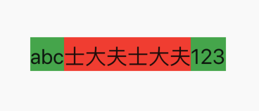

# 使用StrutStyle实现文本对齐

### 起因

在Android字体下左右文本经常出现不能对齐的现象，在中英文混排的情况下尤为明显

### 测试

下面贴一段我们测试的代码

#### 代码

```dart
Row(
  mainAxisAlignment: MainAxisAlignment.center,
  children: <Widget>[
    Container(
      color: Colors.green,
      child: const Text(
        "abc",
        style: TextStyle(
          fontSize: 30.0,
        ),
      ),
    ),
    Container(
      color: Colors.red,
      child: const Text(
        "士大夫士大夫",
        style: TextStyle(
          fontSize: 30.0,
        ),
      ),
    ),
    Container(
      color: Colors.green,
      child: const Text(
        "123",
        style: TextStyle(
          fontSize: 30.0,
        ),
      ),
    ),
  ],
)
```

#### 效果



**在这里就明显出现了英文跟中文渲染出来的高度的不同**

### 使用`StrutStyle`

#### 代码

```dart
Row(
  mainAxisAlignment: MainAxisAlignment.center,
  children: <Widget>[
    Container(
      color: Colors.green,
      child: const Text(
        "abc",
        style: TextStyle(
          fontSize: 30.0,
        ),
        strutStyle: StrutStyle(
          fontSize: 30.0,
          height: 1.6,
        ),
      ),
    ),
    Container(
      color: Colors.red,
      child: const Text(
        "士大夫士大夫",
        style: TextStyle(
          fontSize: 30.0,
        ),
        strutStyle: StrutStyle(
          fontSize: 30.0,
          height: 1.6,
        ),
      ),
    ),
    Container(
      color: Colors.green,
      child: const Text(
        "123",
        style: TextStyle(
          fontSize: 30.0,
        ),
        strutStyle: StrutStyle(
          fontSize: 30.0,
          height: 1.6,
        ),
      ),
    ),
  ],
)
```

#### 效果


**实现了同样的高度**

